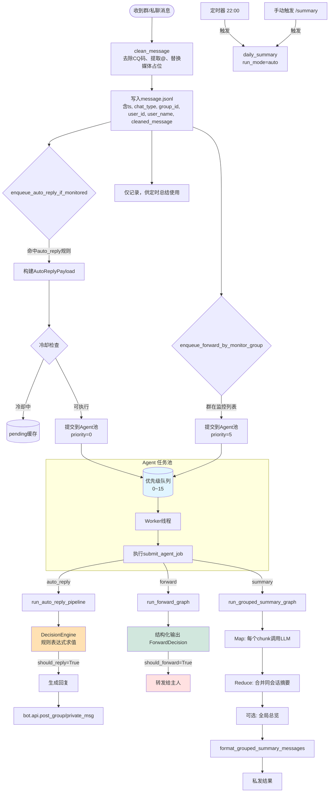

# QQ Bot

## 项目介绍

这是一个基于 Python 的聊天机器人系统，采用模块化 Agent 架构，利用 LangGraph 构建工作流，支持自动回复、消息转发、每日摘要等多种智能任务。系统基于 Napcat 框架与 QQ 进行交互，所有消息经过清洗、结构化记录，并通过优先级任务池进行高效调度。

## Agent 工作流与配置文档

- [Summary 工作流与配置项](docs/summary.md)
- [Forward 工作流与配置项](docs/forward.md)
- [AutoReply 工作流与配置项](docs/auto_reply.md)
- [Makefile 使用指南（Docker 打包与部署）](docs/makefile.md)

## 项目架构

本项目采用 **配置驱动 + 工作流引擎 + 优先级调度** 的设计理念：

1. 每个 Agent（如 `summary`, `forward`, `auto_reply`）均作为独立的工作流模块，由 `agent_config.yaml` 统一管理参数。
2. 消息通过 `main.py` 中的事件监听器进入系统，经过去除 CQ 码、提取发送者信息等预处理后，根据配置规则分发至对应工作流。
3. 所有耗时任务（特别是 LLM 调用）通过 **Agent 任务池**（`agent_pool.py`）进行优先级队列调度，支持动态扩缩容、超时控制、线程池隔离。
4. 整个流程通过 `agent_observe.py` 输出结构化 JSONL 日志，便于监控与分析。

## 架构说明

### 核心组件

| 组件 | 职责 |
|------|------|
| `main.py` | 启动入口，注册 Napcat 事件回调，初始化 Agent 池，挂载定时任务 |
| `agent_config.yaml` | 全局配置文件，每个 Agent 独立配置节，支持热加载 |
| `agent_config_loader.py` | 动态加载当前工作流的专属配置 |
| `agent_pool.py` | 优先级任务调度器，Worker 池，支持 0–15 级优先级 |
| `agent_observe.py` | 统一日志观测框架，生成 `run_id`，记录各阶段事件 |
| `workflows/` | 各 Agent 工作流实现，均继承 LangGraph 状态机模式 |

### 工作流设计模式

每个工作流均遵循以下模式：

- **配置加载**：通过 `load_current_agent_config(__file__)` 获取专属配置
- **观测绑定**：使用 `bind_agent_event()` 生成带 `run_id` 的日志函数
- **任务提交**：通过 `submit_agent_job()` 将同步/异步函数提交至 Agent 池
- **状态管理**：使用 LangGraph 构建有向无环图，节点为 LLM 调用或纯逻辑处理
- **结构化输出**：利用 Pydantic 模型约束 LLM 输出格式

### 优先级调度策略

- **优先级范围**：0（最高）～15（最低）
- **调度策略**：严格优先级抢占，相同优先级按 FIFO
- **队列容量**：可配置（默认 100），满则抛出异常
- **Worker 管理**：支持运行时动态扩容/缩容，平滑退出
- **任务超时**：每个任务可指定超时时间，超时自动取消 Future

## 工作流详解

### 1. AutoReply 自动回复工作流

- **触发方式**：群聊/私聊消息 → 根据 `rules` 规则匹配会话 ID
- **冷却机制**：每会话独立冷却窗口，支持 `@bot` 跳过冷却
- **决策逻辑**：支持 `always` / `keyword` / `at_bot` / `ai_decide` 及逻辑组合表达式
- **上下文构建**：从 `message.jsonl` 读取近期消息，按会话、时间窗口、字符数截取
- **生成回复**：命中规则后使用 `reply_prompt` 调用 LLM 生成文本
- **发送限制**：仅当 `should_reply=True` 且 `reply_text` 非空时发送

### 2. Forward 消息转发工作流

- **监控范围**：通过 `monitor_group_qq_number` 配置需监听的群
- **判定模型**：单节点 LangGraph，调用 LLM 判断是否值得转发给主人
- **转发格式**：自动生成包含时间、群号、发送者、内容的格式化消息
- **优先级**：固定为 5（高于普通回复，低于紧急任务）

### 3. Summary 每日摘要工作流

- **日志记录**：所有群聊/私聊消息经清洗后写入 `message.jsonl`
- **触发方式**：定时（每日 22:00）或手动命令 `/summary`
- **筛选策略**：支持 `chat_scope`（group/private/all）、群号黑白名单、游标增量
- **分块处理**：按用户聚合消息，以 10K 字符为 chunk，跨 chunk 自动合并小段
- **双层总结**：
  - **Map**：每 chunk 生成结构化摘要（overview, highlights, risks, todos, evidence）
  - **Reduce**：同一会话的多个 chunk 可二次调用 LLM 整合（可配置）
- **全局总览**：可选，在所有群摘要之上再生成一句话总体态势
- **发送模式**：支持单条聚合消息或“总览+各群明细”多条发送

## 消息处理详细流程

### 核心处理链路



### 任务类型与优先级

| 任务类型 | 说明 | 默认优先级 | 调度特性 |
|---------|------|-----------|---------|
| `AUTO_REPLY` | 自动回复判定+生成 | 0 | 最高优先级，低延迟要求 |
| `FORWARD` | 消息转发判定 | 5 | 普通优先级 |
| `SUMMARY` | 每日摘要 | 6 | 可接受秒级延迟 |

## 统一观测日志

所有 Agent 在执行过程中均通过 `agent_observe.py` 输出结构化日志，存储于 `logs/agent_events.jsonl`。每条日志包含：

- `run_id`：一次完整调用链路的唯一标识
- `agent_name`：工作流名称（summary/forward/auto_reply）
- `stage`：阶段标识（start/end/rule_evaluated/ai_decide_start 等）
- `latency_ms`：阶段耗时
- `decision`：关键决策信息（should_reply/should_forward 及原因）
- `extra`：自定义扩展字段

日志可用于实时监控、成本分析、调试回放。

## 配置管理

所有 Agent 配置集中在项目根目录的 `agent_config.yaml` 中，结构如下：

```yaml
summary_config:
  file_name: summary.py
  config:
    model: qwen3-max-2026-01-23
    temperature: 0.2
    summary_chat_scope: group
    summary_group_ids: ["群号1", "群号2"]
    # ... 其他参数

forward_config:
  file_name: forward.py
  config:
    monitor_group_qq_number: ["群号"]
    forward_decision_prompt: "..."
    # ...

auto_reply_config:
  file_name: auto_reply.py
  config:
    min_reply_interval_seconds: 10
    rules:
      - enabled: true
        chat_type: group
        number: "群号"
        trigger_mode: "ai_decide || keyword"
        # ...
```

系统启动时自动加载，修改配置后**无需重启**，下一次调用对应工作流时即生效（`load_current_agent_config` 每次重新读取文件）。

## 快速开始

### 环境准备

- Python 3.8+
- Napcat 服务（建议本地端口，不暴露公网）
- OpenAI 兼容 API（需配置 `LLM_API_KEY`, `LLM_API_BASE_URL`）

### 安装依赖

```bash
pip install -r requirements.txt
```

### 配置

1. 复制 `.env.example` 为 `.env`，填写 API 密钥。
2. 按需修改 `agent_config.yaml`，至少配置 `auto_reply_config.rules` 和 `forward_config.monitor_group_qq_number`。
3. 在 `bot.py` 中设置机器人 QQ 号及允许处理的群白名单（`allowed_id`）。

### 启动

```bash
python main.py
```

### 首次使用

- 向机器人私聊发送 `/summary` 测试手动摘要功能。
- 在监控群内发送含关键词的消息，观察自动回复。
- 查看 `logs/agent_events.jsonl` 确认日志写入正常。

## 安全机制

1. **源过滤**：通过 `bot.allowed_id` 只处理指定的群聊，避免无关流量。
2. **冷却保护**：`auto_reply` 支持每会话最小回复间隔，防止 LLM 过度调用。
3. **pending 过期**：冷却期间积压的消息超时自动丢弃，防止队列积压。
4. **超时控制**：每个 Agent 任务均设置超时（默认 120s），防止 LLM 卡死。
5. **队列满拒绝**：任务池队列满时新任务立即抛出异常，保护系统稳定性。
6. **日志审计**：所有决策（是否回复、是否转发）均记录原因，可追溯。

## 许可证

本项目采用 MIT 许可证。

## 贡献

欢迎提交 Issue 和 Pull Request。建议遵循以下流程：

1. Fork 仓库
2. 新建 feature 分支
3. 编写代码并补充文档

4. 提交 Pull Request

## 鸣谢

- [ncatbot](https://github.com/liyihao1110/ncatbot) - 简洁高效的 QQ 机器人 Python 框架
- [Napcat](https://napneko.github.io/) - 强大的 QQ 协议实现与消息收发服务


