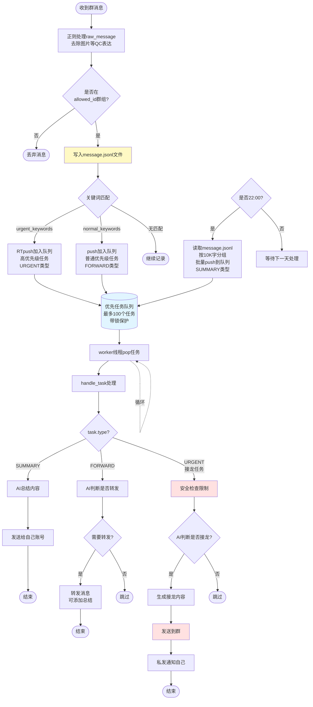

# QQ Bot

## 项目介绍

这是一个基于 Python 的聊天机器人，其核心功能为自动接龙和群消息总结，目前使用 Napcat 作为信息收发方式开发。

## Agent 文档

- [Summary 工作流与配置项](docs/summary.md)
- [Forward 工作流与配置项](docs/forward.md)
- [Auto Reply 工作流与配置项](docs/auto_reply.md)

## 项目架构

本项目采用多种方式对消息进行过滤以便于 AI 处理：

1. 基于消息号码进行初步过滤
2. 基于正则与消息号码进行分类
3. 维护一个任务优先队列对将消息分类有序的投入 AI
4. 维护多个 AI 对话线程，从任务队列中依次获取任务

## 架构说明

1. 基于消息号码和正则（暂时是关键词，够用了）的分类，将任务分为 RT 类型和 IDLE 类型，其中 RT 类型分为回复型和转发型，IDLE 用于定期总结
2. 实现支持 RT 类型和 IDLE 类型的消息队列，学习 Linux 的部分任务调度机制实现调度器
3. 针对 RT 类任务和 IDLE 任务进行不同 AI 处理

### AI 任务处理

1. 针对 RT 型任务，直接交由 AI 处理，AI 提示词要说明 AI 要使用特定格式内容回复，然后使用正则等方式提取出 AI 回复中的内容和发送对象，进行消息发送
2. 针对 IDLE 型总结任务，每次调用都将内容写入日志，定期从日志中获取适当长度的内容然后直接发送 AI 返回的内容

## 安全问题

1. 机器人有在多个重要的大群回复的权限，严防恶意攻击，Napcat 部署的时候最好配置外部无法访问的端口
2. 防止 AI 乱发消息，群中发送的消息应当加上消息长度和发送频率限制，触发后暂停服务并发送警报

## Agent 消息处理详细说明

### 消息处理流程

本项目基于 Napcat 框架实现 QQ 群聊天机器人的消息处理系统。

### 核心处理机制

1. 通过 `allowed_id` 对原始消息进行 QC（质量控制），过滤不需要处理的消息源，节省 token 开销
2. 所有消息写入 `message.jsonl` 日志文件
3. `bot.py` 中使用两个队列：`urgent` 队列（紧急消息）和 `normal` 队列（普通消息）
4. 根据预设的 `urgent_keywords` 判断消息是否为紧急消息，匹配则进入 `urgent` 队列
5. 根据预设的 `normal_keywords` 判断消息是否需要转发，匹配则进入 `normal` 队列
6. 其他消息直接写入日志，不进入队列
7. 每晚 22:00 触发定时任务，从 `message.jsonl` 中提取当日消息（限制 10K token），推送到 `normal` 队列进行总结
8. 多个 `worker` 线程从队列中 `pop` 消息并调用 `handle_task` 进行处理

### 消息处理流程图

### 任务类型说明

消息队列中的任务按照 `task.type` 分为三种类型：

\begin{itemize}
\item \textbf{SUMMARY}：总结类型，用于每日 22:00 的批量消息总结
\item \textbf{FORWARD}：转发类型，匹配 `normal_keywords` 的消息，需要 AI 判断是否转发
\item \textbf{URGENT}：紧急类型，匹配 `urgent_keywords` 的消息，需要立即处理（如接龙消息）
\end{itemize}

任务对象还包含其他属性如 `priority`（优先级）和 `timestamp`（时间戳）用于队列排序。

### 代码结构

项目主要包含以下模块：

- **handler.py**：消息处理器，负责消息预处理、关键词匹配、队列推送
- **bot.py**：机器人主逻辑，维护 `urgent` 和 `normal` 两个队列
- **main.py**：程序入口，使用 `@startup_event` 启动 `worker` 线程
- **worker**：工作线程，循环从队列中获取任务并调用 `handle_task` 处理
- **handle_task**：根据 `task.type` 分发到不同的处理函数（SUMMARY、FORWARD、URGENT）

### 消息安全机制

为防止 AI 恶意攻击和误操作，系统实现了多层安全保障：

1. 通过 `allowed_id` 白名单机制，只处理授权来源的消息
2. 在 URGENT 类型消息处理前增加安全检查（SafetyCheck），过滤敏感内容
3. 群消息发送前需经过 AI 二次判断，避免误发
4. 发送重要消息后通知管理员，便于监控
5. 消息长度和发送频率限制（建议在代码中实现）

## 快速开始

### 环境要求

- Python 3.8+
- Napcat 框架
- AI API 服务（如 OpenAI、Claude 等）

### 配置说明

1. 配置 Napcat 连接信息（建议使用本地端口，不对外开放）
2. 设置 `allowed_id` 白名单，指定允许处理的 QQ 号或群号
3. 配置 `urgent_keywords` 和 `normal_keywords` 关键词列表
4. 设置 AI API 密钥和模型参数
5. 配置日志文件路径（默认为 `message.jsonl`）

### 运行方式

python main.py

程序启动后将自动：

- 连接 Napcat 服务
- 启动多个 worker 线程
- 开始监听群消息
- 每晚 22:00 自动执行消息总结

## 许可证

请在此添加项目许可证信息。

## 贡献

欢迎提交 Issue 和 Pull Request。
