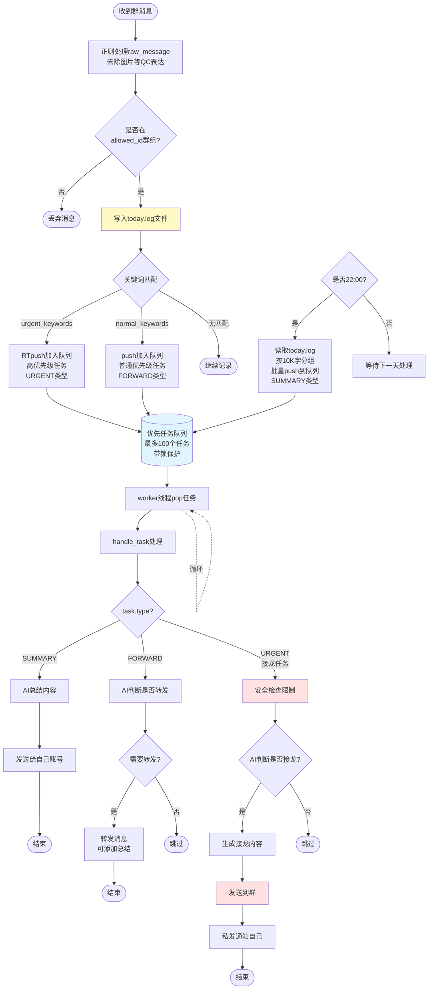

# 现有消息队列介绍以及agent要求

## 现在我实现了什么

1. 调用Ncatbot库 可以自动安装napcat 自动引导配置账号 自动登录启动 napcat不用在管直接调接口
2. 实现了优先任务队列 agent等着消息有序处理就可以了

### 更详细的处理流程说明

#### 功能说明

队列提供了异步的RTpush push和pop方法 用来添加和提取任务(有锁来保证安全)
使用RTpush添加高优先级任务，使用push添加一般任务，使用pop提取当前分配的一个任务
无论时间高优先级任务优先 同优先级时间早的任务优先
任务最多100个 满了直接丢弃多的任务

目前高优先级任务是接龙，转发是低优先级(都发群了能有多急 真急就@了 自己能收到)

#### 队列实现说明

队列中的每一个任务都是需要agent处理的内容，队列是紧挨在agent前的缓冲区
队列中的任务agent要用的信息有type和msg，type有SUMMARY,FORWARD,GROUPNOTE 分别代表了总结任务，转发任务，接龙任务
队列自身用到的任务信息有priority，timestamp 这是用来给任务排序的

#### 处理流程

1. 收到的**allowed_id中的群的**消息首先的raw_message会经过正则识别和替换去除图片等用的[QC]这样的表达 节省token和储存
2. 匹配的写入today.log文件中
3. 随后匹配的消息会经过 bot.py 中的 urgent 和 normal关键词匹配
4. urgent_keywords匹配将作为urgent任务直接加入队列
5. normal_keywords匹配作为normal任务直接加入队列
6. 都不匹配的再做处理
7. 每天22：00 将自动将today.log中的内容每10K字一组push到队列中处理(使用锁保护和零时文件替换 能保证安全 处理期间的信息留给下一天处理)
8. worker()会pop任务然后阻塞的调用handle_task()处理任务

## 智能体要实现的任务

实现传入的任务的处理，来了任务就处理就可以，定时还有队列缓冲我已经实现

只用修改 handler.py bot.py (可以考虑用来放参数 如果要统一把bot中的部分参数改到其他配置文件中 我很乐意改 毕竟这是个为了放全局变量加的文件 放用户参数不优雅)

main.py也可以修改 可以在@startup_event() 中多创建几个worker 这样可以实现并行 但是要注意多worker要求worker之间没有冲突

handle_task()会被循环调用一次处理任务
handle_task接收task
考虑使用 task.type初步分类(已经给出部分)

智能体针对 SUMMARY 任务 直接总结了回传总结内容 然后发送给自己的号就可以

针对 FORWARD 转发任务 使用智能体判断是否需要转发 有必要就转发(可以考虑添加总结)

针对 URGENT 类任务 现在主要是接龙任务 判断是否接龙 接龙什么内容 有必要就接龙 然后还要私发消息通知自己

## 安全问题

只有 URGENT 类接龙任务 存在群发 所以建议在局部添加限制 避免把相关代码引入到其他用不到的文件中形成屎山
